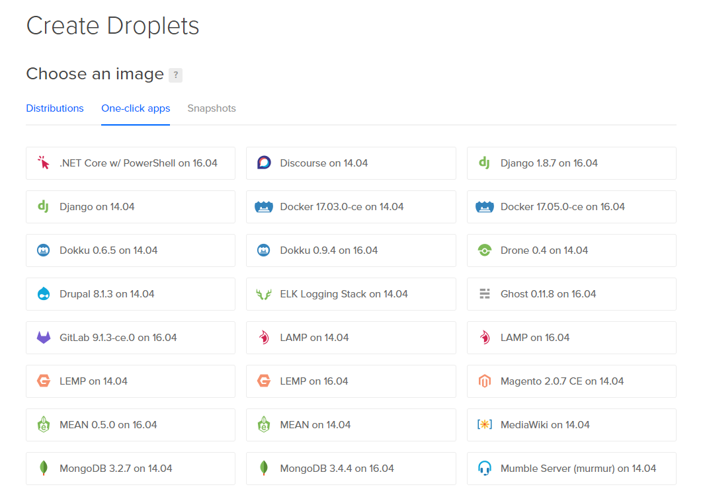
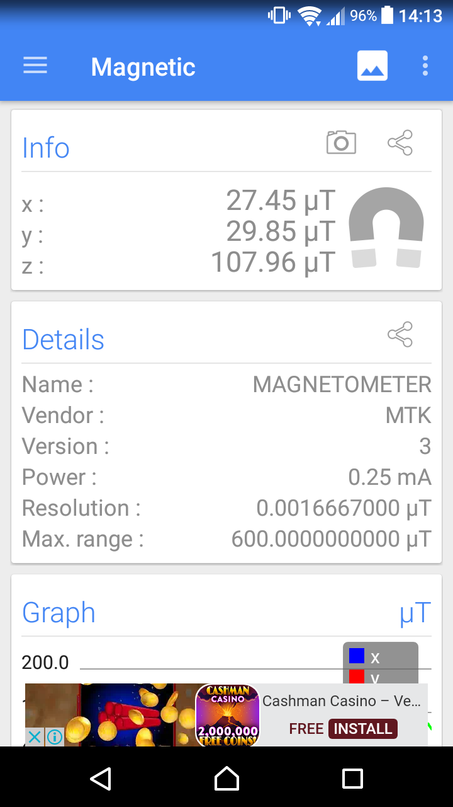

<h1>Deploying Django Applications</h1>

I was tasked with looking at the deployment of our Django based restful API. We needed to deploy this somewhere that was publicly accessible and also free or low cost to host. Once a location for hosting was selected, I needed to identify the best way to manage the Django app on the server..

The first option I looked at was using a VPS on a Digital Oceans server. Digital Ocean make it very easy to setup a VPS that is ready to run Django apps by making use of their one click apps. With one click had Django 1.8.7 installed and ready to go on an Ubuntu 16.04 server. This Option seemed to be a good way of running things aside from the fact that it would cost me $5USD a month, which I was not too worried about paying. I decided this option was not the best though when I started thing about setting up the Django App for the client in the future. Because of this I decided to look into deploying Django apps in a Docker container. I looked at the options that were available for Django deployment on Docker Hub. There is a Docker for Django but it is unfortunately no longer being supported. It is now recommended that people use the standard python Docker and install the library they need onto it. My hosting options for Docker are the same as the first option, there is a one click app that is available on Digital Ocean that would set us up with an Ubuntu server running Docker. Once again there would be a monthly cost of $5USD. I really liked this option because Docker containers are easy to move from one server to another. Using this we would be able to develop an app, test it on the server, then port it directly to another server without having to worry about set up or support on the production server. This is because Docker containers run in a virtualised environment, therefore the hardware and operating system are not of concern.

I decided that I should also look at some free options for hosting. The students from last semester used pythonanywhere to host their solutions so I looked into it. I find that deploying to python anywhere was very easy. I wrote documentation on this process as it will be where we test all of our Django Apps. I decided to use python anywhere because it is free for us to use for development. Unfortunately is will not be as easy to deploy for end users. However I am glad that I looked at Docker because I think it will be the easiest way for us give the app to the end users. So for now we will develop on python anywhere but when it is time to put it into production I think it will be best to port the app into a Docker container and put that on the production server.

You can find my documentation for the deployment of Django apps can be found in the docs file in the project repoi. I also looked at these Docker ii iii.

<h1>Building ASP.NET Rest API’s</h1>

I had a hard time working with ASP.NET Rest API’s. I made a large mistake when initially making the whole system. I was taking the approach of making the models and then doing the database. This proved to be much more difficult than doing it the other way around. We first built all of the classes for our data model, and then allowed Entity Framework Core (the .NET ORM tool) to create the database. This proved to be very difficult to set up. I struggled to write the LINQ to get the data I needed. After a lot of trying and failing, I asked Patricia for some help. She built an example for us to look at and we sat down and she went through it. She showed us how she built the app. She started by building a database then letting Entity Framework do all the work of creating all of the classes needed to access data.

I think that my problem with this task was that I thought that not having to deal with the database would make the API easier to build. This was incorrect. I should have put in the effort to make the database first and then build the API on top of the data.

<h1>Dealing with Google Cardboard Magnet Button</h1>

We were having a lot of trouble working with the magnet in the Google Cardboard AR headset. This button is used to add interaction when you are in the virtual environment. The problem with the magnet is that it never works.

To test how much the magnet sensor reacts to the button activation, I downloaded an applicationiv that shows you the readings of all of the sensors on your phone. I put my phone into the Google Cardboard and tested the button. The change in the magnet sensor reading was within margin of error. I decided that I should check where the magnet sensor is in my phone. I did this by moving the magnet around my phone. I found that my magnet sensor is in the opposite end of the phone. So when you naturally put the phone into the Cardboard the sensor is as far away as it can be from the magnet button. So I put my phone in the cardboard upside-down. I finally started seeing a decent change in the magnet sensor readings when I activated the button. 

<h1>Working with MVC’s in Django and ASP.NET</h1>

During this experience I have noticed something about myself when it comes to how I try to learn things. When first working with a Django I went straight to looking at how to use Django without having any knowledge on the concept of a MVC. I made the mistake of not taking a step backwards and looking at the big picture. Instead I started trying to use something that is built using an architecture I know nothing about. I learned that it is important that I look at the tool I’m trying to learn from a low conceptual level. I realized this after having a class on MVC in OOSD. After actually learning about how MVC works everything about how Django and ASP.NET work made sense immediately and I could see how all of the application that have been built work.

